#  LESA: Longitudinal Elastic Shape Analysis of Brain Subcortical Structures

## Introduction

 Longitudinal neuroimaging plays a critical role in mapping the neural developmental profile of the brain. Among all features in a brain image, shapes of the subcortical regions are probably among the most interesting and useful ones since they characterize these vital structures in the brain. However, statistical analysis of longitudinal subcortical shapes is still in its infancy due to challenges in shape extraction, representation, and modeling. This paper develops a simple and efficient framework for longitudinal elastic shape analysis (LESA) of subcortical shapes. In LESA, subcortical regions are segmented, extracted, and represented as parameterized 3D surfaces. Integrating ideas from elastic shape analysis of static surfaces, principal component analysis (PCA) of shapes, and statistical modeling of sparse longitudinal data, LESA provides a fundamental toolbox for systematically studying sparse longitudinal surface shapes. The key novelties of LESA include: (i) it can efficiently capture complex subcortical structures using a small basis, and (ii) it can accurately predict spatiotemporal changes using simple statistical models. We applied LESA to analyze three longitudinal datasets and showcase its applications in estimating continuous surface trajectories, building life-span growth patterns, and comparing shape differences among different groups.

## Pipeline

## Data

We have applied LESA to study three different longitudinal brain imaging datasets: the Alzheimer’s Disease Neuroimaging Initiative (ADNI) dataset, the Human Connectome Project test-retest dataset and the OpenPain dataset. For simplicity, we mainly focus on the lateral ventricle and left hippocampus surfaces.
  
 
  *Panel (a) shows age distributions in the three datasets. The rest panels show the temporal information on scans for each subject.*

## PCA results

Then, with global mean surfaces and aligned individual surfaces, we run PCA. For ventricle surfaces, 33 principal components can explain over 95% shape variabilities. Meanwhile, left hippocampus surfaces need 61 principal components to explain over 95% shape variabilities.

1) **Ventricle**\
     
  *PCA results of the ADNI’s lateral ventricle surfaces. (a) Karcher mean of all LV surfaces. (b) Cumulative percentage of variance explained by the number of PCs. (c) First dominant PC direction reconstructed as f_{\mu}&plus;t\sqrt{\lambda_{1}}PC_{1}
  . The five shapes in the front view, from left to right, correspond to t = {−1; −0:5; 0; 0:5; 1}. (c) Surface area trajectories. (e) PC1 score trajectories.*

2) **Left hippocampus**\
   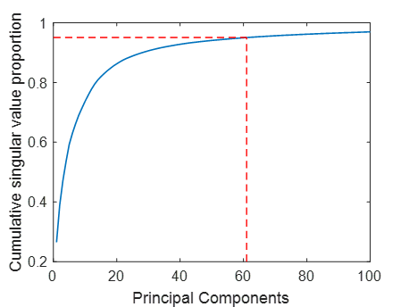 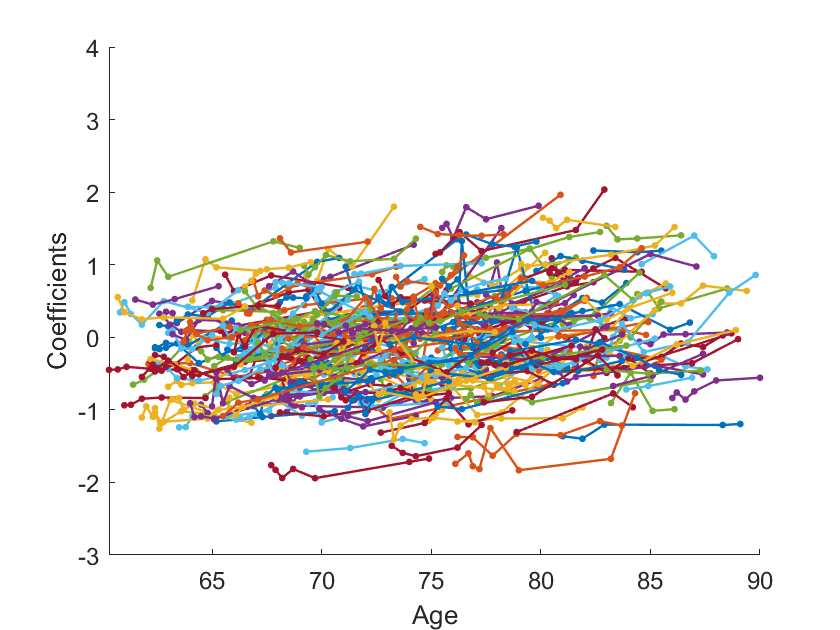 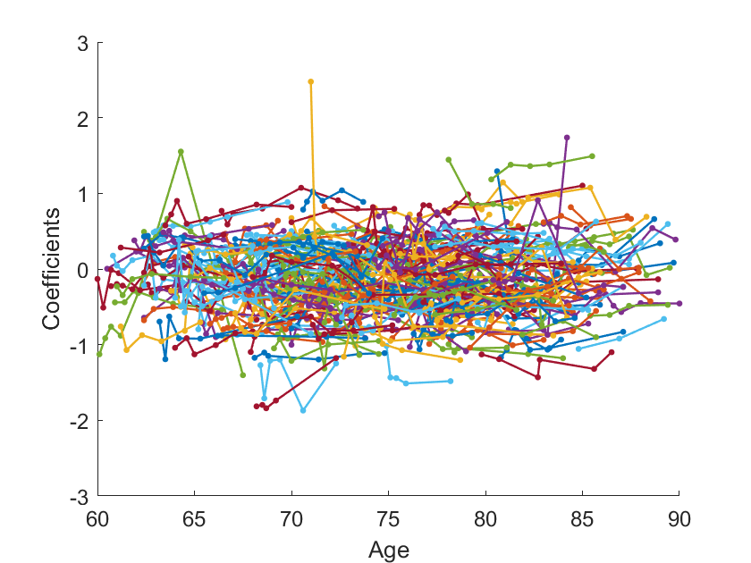  
  *(a) Cumulative variability explained* &nbsp; &nbsp; &nbsp; *(b) Sparse 1st PCs* &nbsp; &nbsp; &nbsp; &nbsp; &nbsp; *(c) Sparse 2nd PCs*

## Densely Fitting

We densely fit area trajectories and principal coefficients trajectories with two methods: PACE and MGCV, and we compare the performance under two methods.
1) **Ventricle area trajectories:**\
   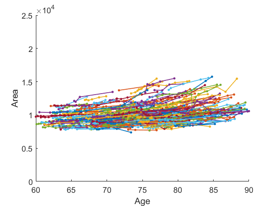 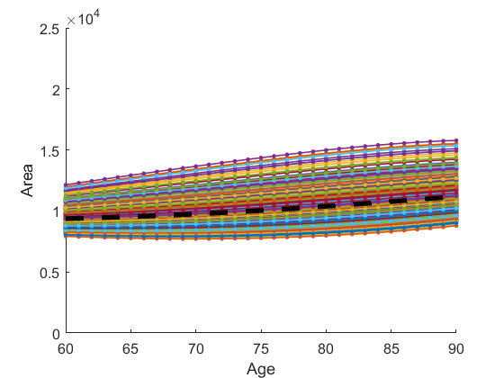  
  *(a) Sparse area trajectories* &nbsp; &nbsp; &nbsp; &nbsp; &nbsp; &nbsp; *(b) PACE fitting* &nbsp; &nbsp; &nbsp; &nbsp; &nbsp; &nbsp; *(c) MGCV fitting*
  
2) **Left hippocampus area trajectories:**\
   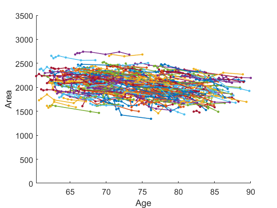 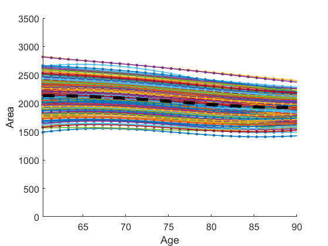 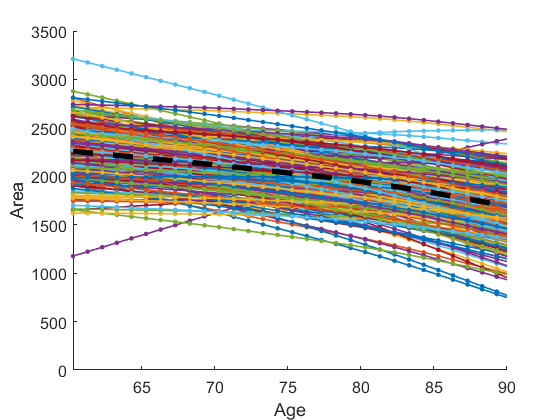 
  *(a) Sparse area trajectories* &nbsp; &nbsp; &nbsp; &nbsp; &nbsp; &nbsp; *(b) PACE fitting* &nbsp; &nbsp; &nbsp; &nbsp; &nbsp; &nbsp; *(c) MGCV fitting*
  
3) **Ventricle principal coefficients trajectories:**\
   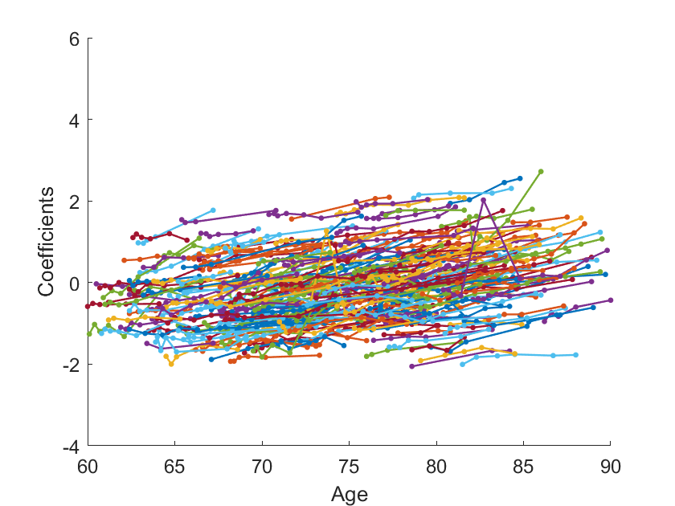 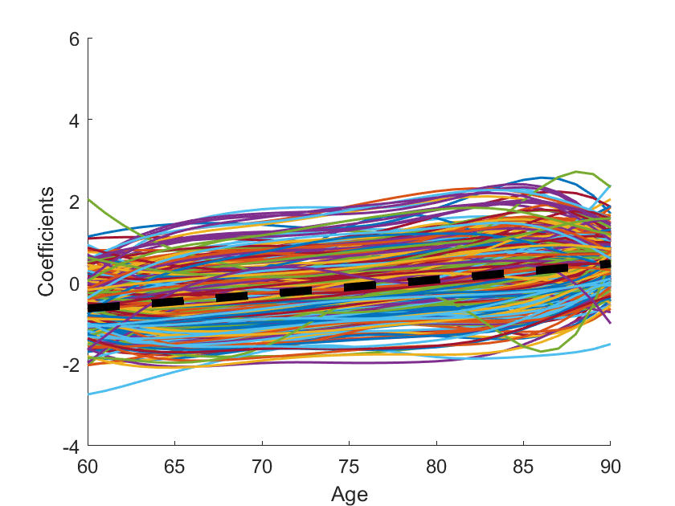 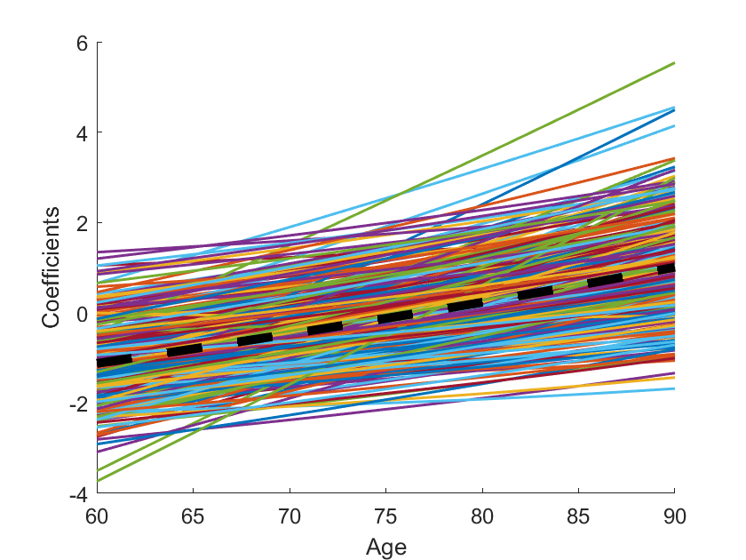 
   *(a) Sparse 1st PC trajectories* &nbsp; &nbsp; &nbsp; &nbsp; &nbsp; &nbsp; *(b) PACE fitting* &nbsp; &nbsp; &nbsp; &nbsp; &nbsp; &nbsp; &nbsp; *(c) MGCV fitting*
   
    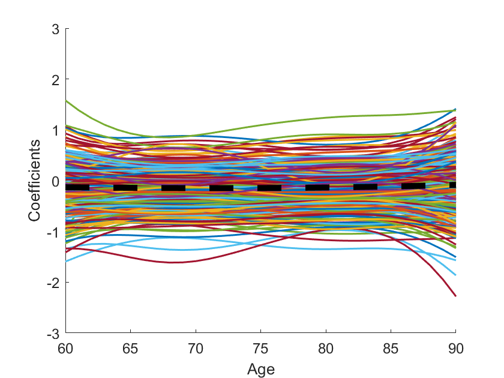 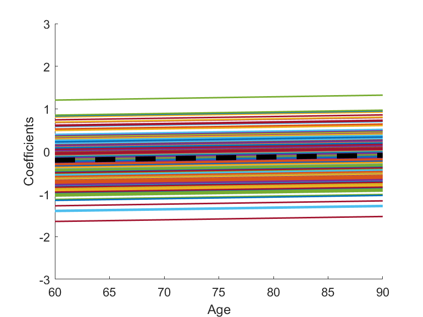 
   *(a) Sparse 2nd PC trajectories* &nbsp; &nbsp; &nbsp; &nbsp; &nbsp; &nbsp; *(b) PACE fitting* &nbsp; &nbsp; &nbsp; &nbsp; &nbsp; &nbsp; &nbsp; *(c) MGCV fitting*
   
4) **Left hippocampus principal coefficients trajectories:**\
    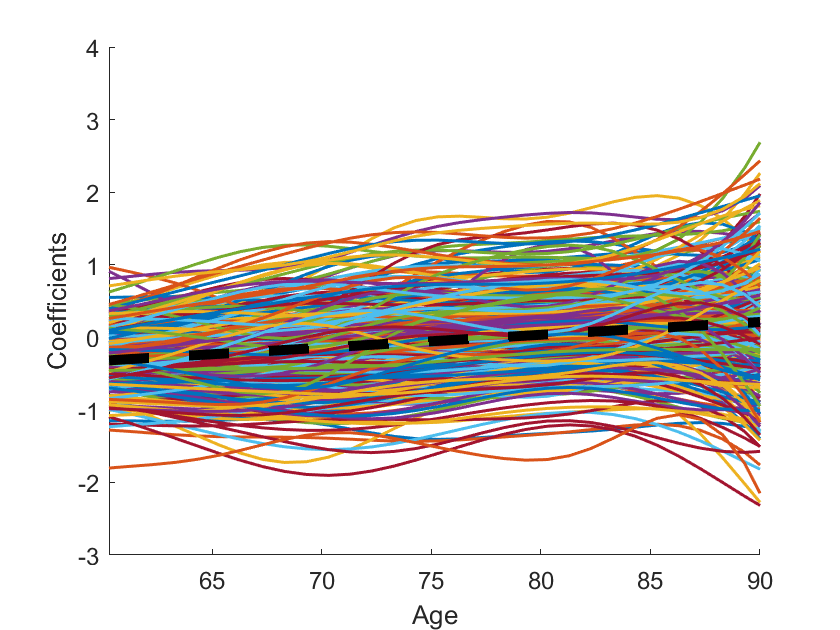 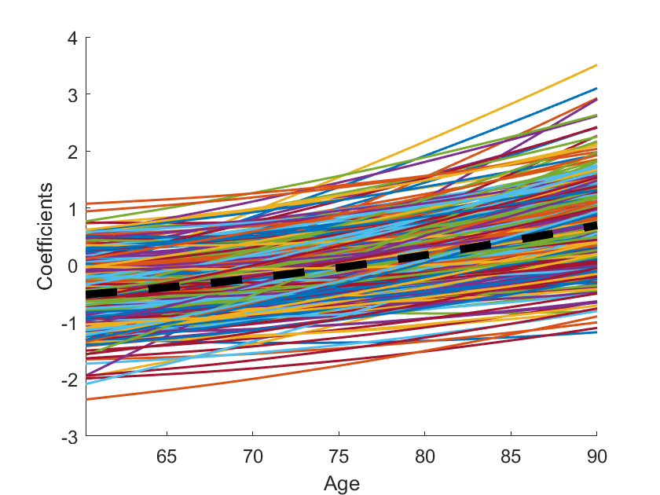 
   *(a) Sparse 1st PC trajectories* &nbsp; &nbsp; &nbsp; &nbsp; &nbsp; &nbsp; *(b) PACE fitting* &nbsp; &nbsp; &nbsp; &nbsp; &nbsp; &nbsp; &nbsp; *(c) MGCV fitting*
   
   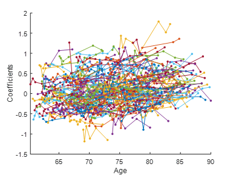 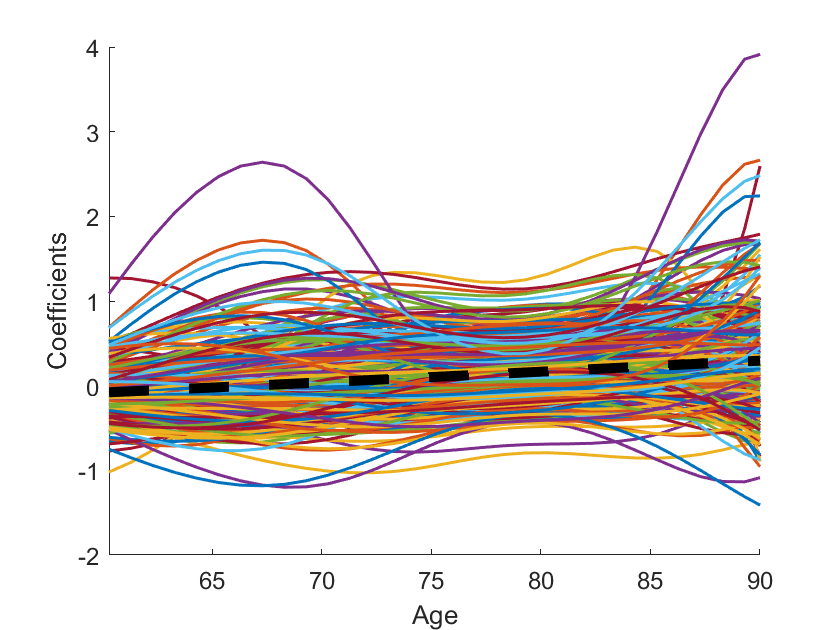 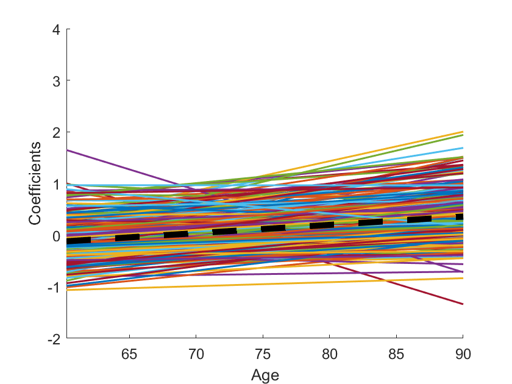 
   *(a) Sparse 2nd PC trajectories* &nbsp; &nbsp; &nbsp; &nbsp; &nbsp; &nbsp; *(b) PACE fitting* &nbsp; &nbsp; &nbsp; &nbsp; &nbsp; &nbsp; &nbsp; *(c) MGCV fitting*
   
5) **Some individual fitting examples:**\
     
     

6) **Performance comparison:**\
    Mean squared error
    <table>
   
    |          |     PACE    |      MGCV    |     PACE    |      MGCV    |
    | -------- | ----------- | ------------ | ----------- | ------------ |
    | **Area** |   454.1950  | **266.7515** |    87.7912  |  **69.9117** |
    | **PC1**  |  **0.0898** |    0.1072    |  **0.0427** |    0.0443    |
    | **PC2**  |  **0.1122** |    0.1280    |  **0.0815** |    0.0865    |
    | **PC4**  | **0.1298**  |    0.1351    |  **0.0554** |    0.0584    |
    | **PC5**  | **0.0944**  |    0.0987    |  **0.1034** |    0.1106    |
    | **PC6**  | **0.1835**  |    0.1967    |  **0.1068** |    0.1125    | 
    | **PC7**  | **0.1728**  |    0.1800    |  **0.2110** |    0.2254    |
    | **PC8**  | **0.1453**  |    0.1443    |  **0.1337** |    0.1380    |
    | **PC9**  | **0.0591**  |    0.0591    |  **0.1475** |    0.1557    |
    | **PC10** | **0.1290**  |    0.1406    |  **0.0675** |    0.0688    |
    | **....** |    ....     |      ....    |     ....    |      ....    |
    | **Average PC MSE** | **0.1233** | 0.1301 |  **0.0943**  |  0.0984  |
  
    </table>

## Results

1) **Global ventricle surface trajectories:**\
    
   
2) **Global left hippocampus surface trajectories:**\
    
   
3) **AD, MCI and NL ventricle surface trajectories:**\
     
   
4) **AD, MCI and NL left hippocampus surface trajectories:**\
     

5) **AD, MCI and NL area trajectories comparison:**\
    
   
    
