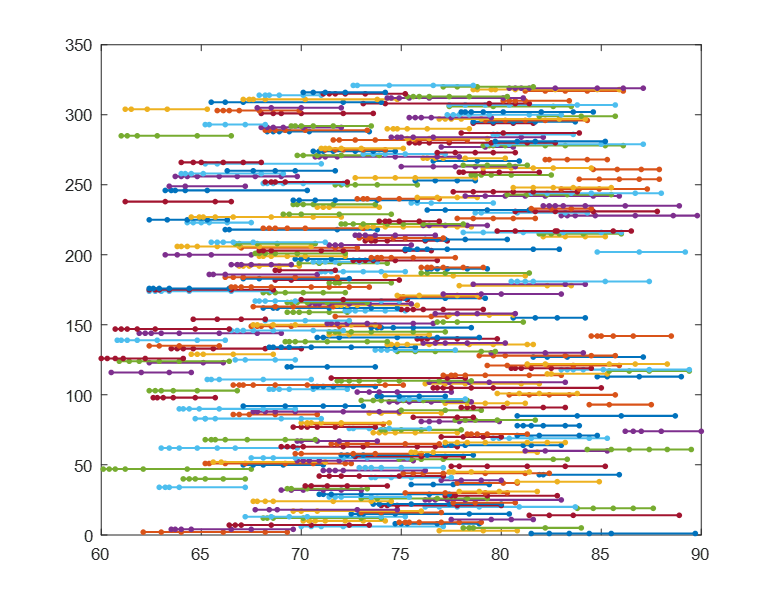
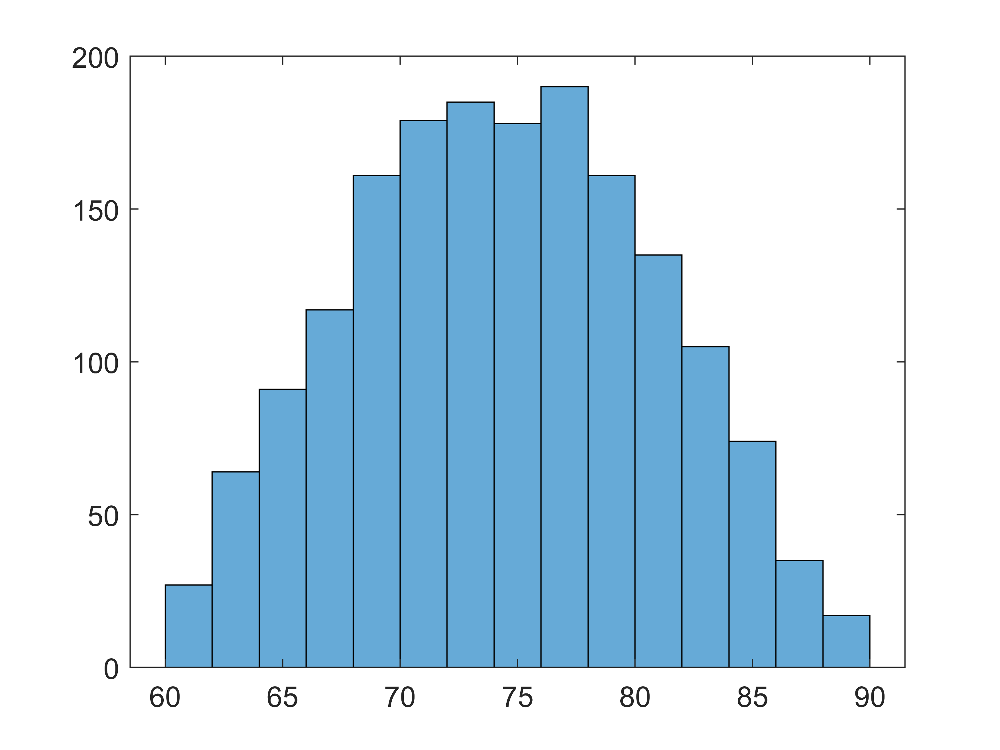
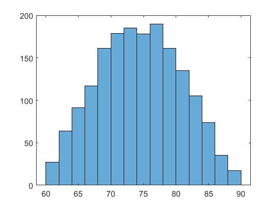
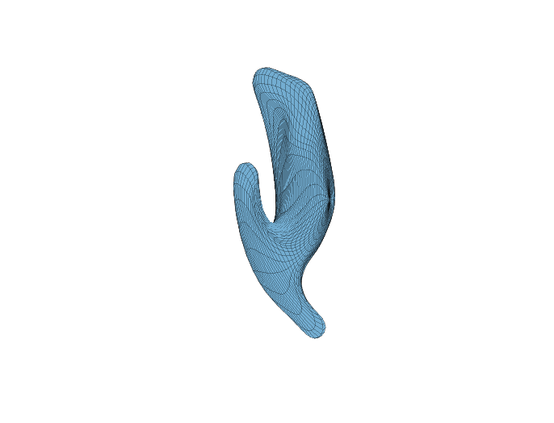
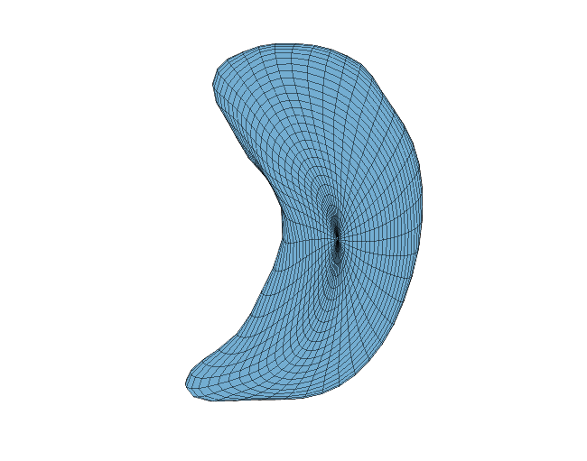
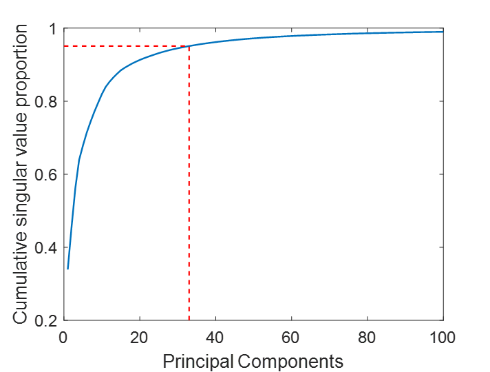

#  Longitudinal Elastic Shape Analysis of Brain Subcortical Structures

## Introduction
Longitudinal neuroimaging data plays a critical role in mapping the neural developmental profile ofmajor neuropsychiatric and neurodegenerative disorders, and in characterizing normal brain development.Among all features that one can extract from the brain image data, the shape of certain region is probablyone of the most interesting and useful ones.  However, longitudinal analysis of shapes is still at itsinfancy given the challenges of shape extraction, representation and modeling. This paper presents anend to end solution for analyzing longitudinal subcortical shapes extracted from human brain images.From the raw image data, subcortial regions are segmented, extracted and represented as parameterized3D surfaces.  We then develop a longitudinal elastic shape analysis (LESA) framework to accuratelydelineate the developmental trajectories of subcortical shapes. LESA integrates ideas from an elastic shaperepresentation for analyzing static surfaces, a principal component analysis (PCA) model for dimensionalreduction of shapes, and efficient statistical models for handling sparse longitudinal data, all into a singleframework. The key novelties of LESA include that: (i) it can efficiently capture complex subcorticalstructures using small number of basis, and (ii) it can accurately predict spatiotemporal changes incortical shapes using statistical models.  We adopt LESA to analyze three longitudinal datasets forbabies, young adults and older adults and show the applications of LESA on inferring the continuousdevelopment trajectory for any subcrotical region for any individual, building life-span growth trajectoriesfor subcortical regions, and comparing shape difference between healthy controls and degenerated brains

## Data

In this research, we include ADNI 2 and ADNI GO dataset. We mainly focus on ventricle and left hippocampus surfaces.

<figure>
  
  <figcaption>Age-scan distribution</figcaption>
</figure> 

 

## Elastic Shape Analysis

First, we compute the global mean for ventricle surfaces and left hippocampus surfaces.

 

Then, with global mean surfaces and aligned individual surfaces, we run PCA. For ventricle surfaces, 33 principal components can explain over 95% shape variabilities. Meanwhile, left hippocampus surfaces need 61 principal components to explain over 95% shape variabilities.

1) Ventricle\
  

2) Left hippocampus\
  

## Densely Fitting
We densely fit area trajectories and principal coefficients trajectories with two methods: PACE and MGCV, and we compare the performance under two methods.
1) Ventricle area trajectories:\
     

2) Left hippocampus area trajectories:\
     

3) Ventricle principal coefficients trajectories:\
     
     
   
   
## Results
1) Global ventricle surface trajectories:\
    
2) Global left hippocampus surface trajectories:\
    
3) AD, MCI and NL ventricle surface trajectories:\
     
4) AD, MCI and NL left hippocampus surface trajectories:\
     
