#  LESA: Longitudinal Elastic Shape Analysis of Brain Subcortical Structures

## Introduction

 Longitudinal neuroimaging plays a critical role in mapping the neural developmental profile of the brain. Among all features in a brain image, shapes of the subcortical regions are probably among the most interesting and useful ones since they characterize these vital structures in the brain. However, statistical analysis of longitudinal subcortical shapes is still in its infancy due to challenges in shape extraction, representation, and modeling. This paper develops a simple and efficient framework for longitudinal elastic shape analysis (LESA) of subcortical shapes. In LESA, subcortical regions are segmented, extracted, and represented as parameterized 3D surfaces. Integrating ideas from elastic shape analysis of static surfaces, principal component analysis (PCA) of shapes, and statistical modeling of sparse longitudinal data, LESA provides a fundamental toolbox for systematically studying sparse longitudinal surface shapes. The key novelties of LESA include: (i) it can efficiently capture complex subcortical structures using a small basis, and (ii) it can accurately predict spatiotemporal changes using simple statistical models. We applied LESA to analyze three longitudinal datasets and showcase its applications in estimating continuous surface trajectories, building life-span growth patterns, and comparing shape differences among different groups.

## Pipeline

## Data

We have applied LESA to study three different longitudinal brain imaging datasets: the Alzheimer’s Disease Neuroimaging Initiative (ADNI) dataset, the Human Connectome Project test-retest dataset and the OpenPain dataset. For simplicity, we mainly focus on the lateral ventricle and left hippocampus surfaces.
  
 
  *Panel (a) shows age distributions in the three datasets. The rest panels show the temporal information on scans for each subject.*

## PCA Results

PCA results of the ADNI dataset. (a) shows the Karcher mean of all surfaces in the ADNIGO2 dataset. Panel (b) shows the cumulative percentage of variance explained by
the number of principal components (PCs). As shown here, the use of 33 and 61 PCs can represent the 95% variation of all lateral ventricle and left hippocampus surfaces seperately. Panel (c) shows the first PC direction in the shape space by reconstructing the principal geodesic as f&mu;+t &radic;&lambda;1PC1, where PC1 represents the first principal direction. We then bring the temporal labels back (the time of each observation) and plot the area trajectories for all subjects in panel (d) and PC1 score trajectories in panel (e).

1) **Lateral Ventricle**\
     
  *PCA results of the ADNI’s lateral ventricle surfaces. (a) Karcher mean of all LV surfaces. (b) Cumulative percentage of variance explained by the number of PCs. (c) First dominant PC direction reconstructed as  f&mu;+t &radic;&lambda;1PC1 . The five shapes in the front view, from left to right, correspond to t = {−1; −0:5; 0; 0:5; 1}. (c) Surface area trajectories. (e) PC1 score trajectories.*

2) **Left hippocampus**\
     
  *PCA results of the ADNI’s left hippocampus surfaces. (a) Karcher mean of all LV surfaces. (b) Cumulative percentage of variance explained by the number of PCs. (c) First dominant PC direction reconstructed as  f&mu;+t &radic;&lambda;1PC1 . The five shapes in the front view, from left to right, correspond to t = {−1; −0:5; 0; 0:5; 1}. (c) Surface area trajectories. (e) PC1 score trajectories.*

## Shape Trajectory Fitting Results

We densely fit area trajectories and principal coefficients trajectories with two methods: PACE and MGCV, and we compare the performance under two methods.
1) **Lateral ventricle trajectories:**\
      
  *(a) Trajectory fitting results of LESA from the observed sparse data. First column: sparse surface area and PC score trajectories. Second and third columns: continuous trajectories fitted by the PACE and MGCV models (black dashed lines: mean trajectories). First row: area trajectories. Second row: PC1 score trajectories. (b) Recovered mean surface trajectories by PACE fitting. (c) Recovered mean surface trajectories by MGCV fitting.*
  
2) **Left hippocampus trajectories:**\
      
  *(a) Trajectory fitting results of LESA from the observed sparse data. First column: sparse surface area and PC score trajectories. Second and third columns: continuous trajectories fitted by the PACE and MGCV models (black dashed lines: mean trajectories). First row: area trajectories. Second row: PC1 score trajectories. (b) Recovered mean surface trajectories by PACE fitting. (c) Recovered mean surface trajectories by MGCV fitting.*
   
3) **Some individual fitting examples:**\
   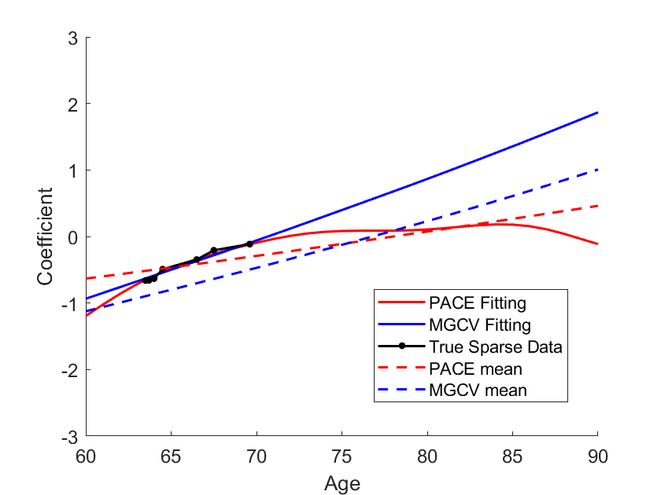 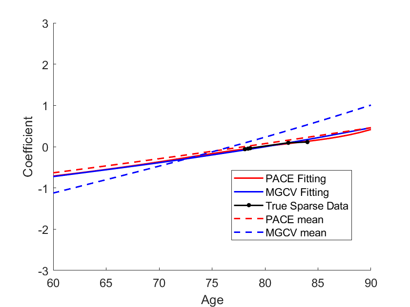 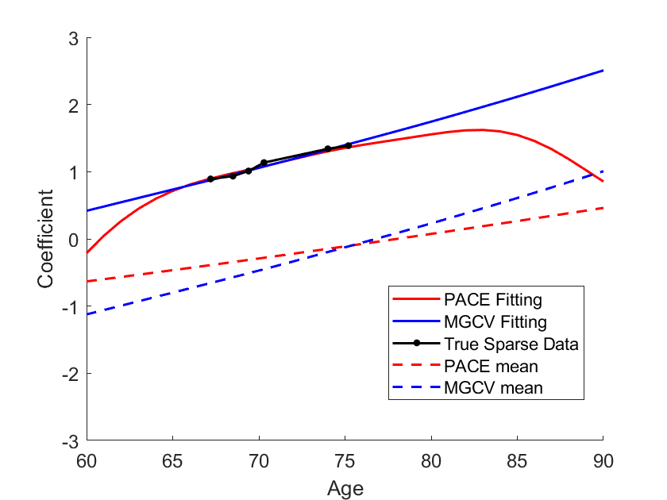
   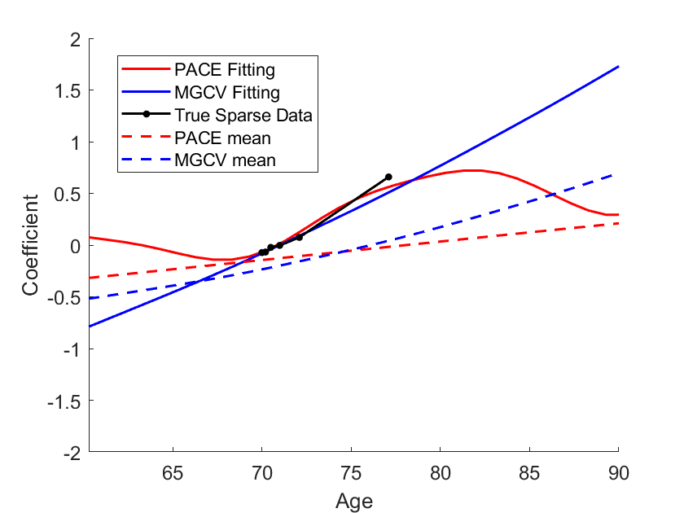  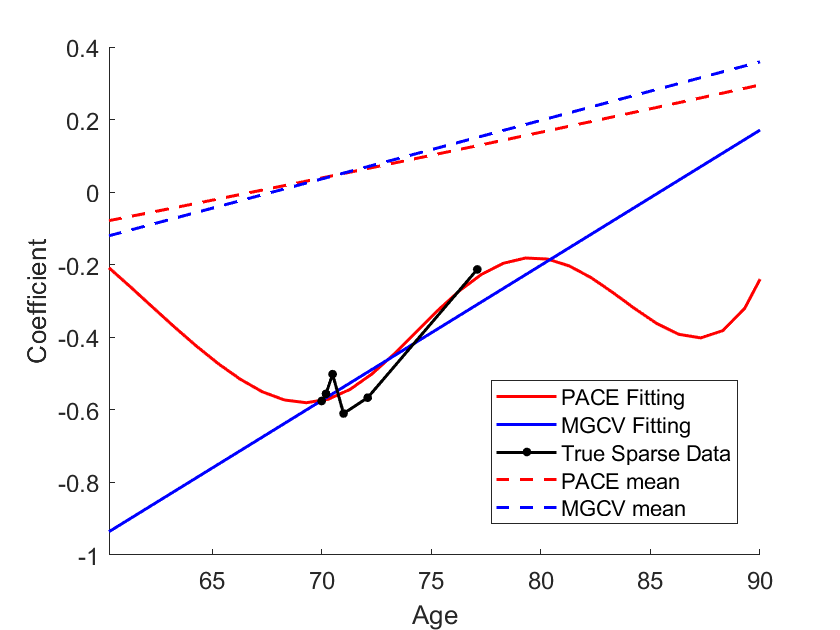

4) **Performance comparison:**\
    Mean squared prediction errors of PACE and MGCV.
    <table>
   
    |          | **Lateral Ventricle**     ||   **Left Hippocampus**    ||
    | -------- | ----------- | ------------ | ----------- | ------------ |
    |          |  **PACE**   |   **MGCV**   |   **PACE**  |   **MGCV**   |
    | -------- | ----------- | ------------ | ----------- | ------------ |
    | **Area** |**112.4383** |   116.2736   | **27.0840** |    31.4153   |
    | **PC1**  |  **0.0367** |    0.0438    |  **0.0246** |    0.0256    |
    | **PC2**  |  **0.0458** |    0.0523    |  **0.0364** |    0.0387    |
    | **PC3**  |  **0.0530** |    0.0558    |  **0.0290** |    0.0303    |
    | **PC4**  |  **0.0490** |    0.0511    |  **0.0320** |    0.0337    |
    | **PC5**  |  **0.0422** |    0.0441    |  **0.0422** |    0.0452    | 
    | **....** |    ....     |      ....    |     ....    |      ....    |
    | **Average PC MSPE** | **0.0536** | 0.0565 |  **0.0423**  |  0.0442  |
  
    </table>

## Results

1) **Global ventricle surface trajectories:**\
    
   
2) **Global left hippocampus surface trajectories:**\
    
   
3) **AD, MCI and NL ventricle surface trajectories:**\
   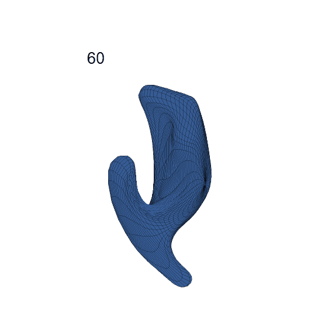 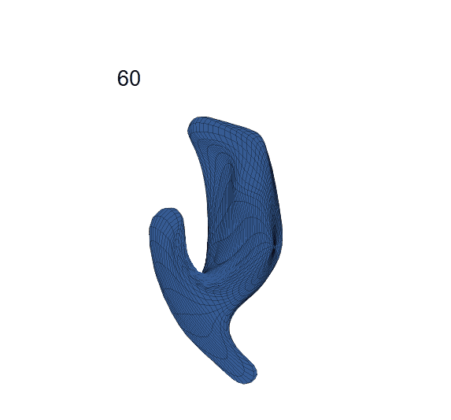 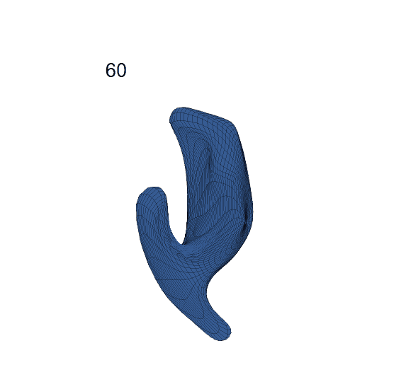
   
4) **AD, MCI and NL left hippocampus surface trajectories:**\
    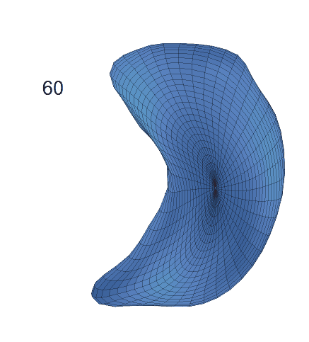 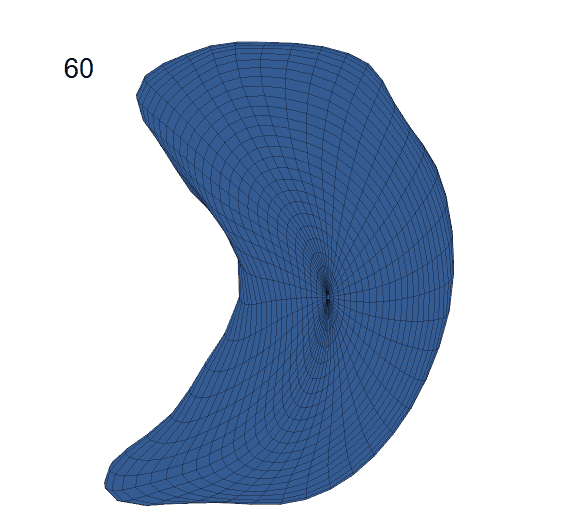

5) **AD, MCI and NL area trajectories comparison:**\
   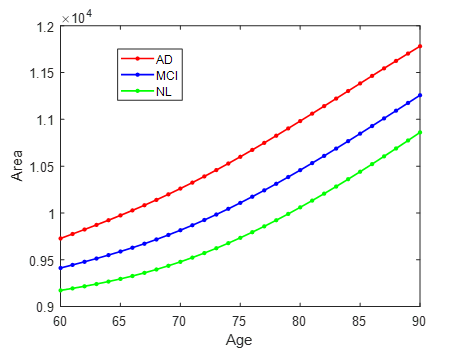 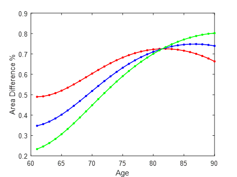
   
   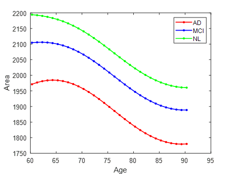 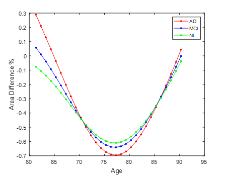
