#  LESA: Longitudinal Elastic Shape Analysis of Brain Subcortical Structures

## Introduction

 Longitudinal neuroimaging plays a critical role in mapping the neural developmental profile of the brain. Among all features in a brain image, shapes of the subcortical regions are probably among the most interesting and useful ones since they characterize these vital structures in the brain. However, statistical analysis of longitudinal subcortical shapes is still in its infancy due to challenges in shape extraction, representation, and modeling. This paper develops a simple and efficient framework for longitudinal elastic shape analysis (LESA) of subcortical shapes. In LESA, subcortical regions are segmented, extracted, and represented as parameterized 3D surfaces. Integrating ideas from elastic shape analysis of static surfaces, principal component analysis (PCA) of shapes, and statistical modeling of sparse longitudinal data, LESA provides a fundamental toolbox for systematically studying sparse longitudinal surface shapes. The key novelties of LESA include: (i) it can efficiently capture complex subcortical structures using a small basis, and (ii) it can accurately predict spatiotemporal changes using simple statistical models. We applied LESA to analyze three longitudinal datasets and showcase its applications in estimating continuous surface trajectories, building life-span growth patterns, and comparing shape differences among different groups.

## Pipeline

## Data

We have applied LESA to study three different longitudinal brain imaging datasets: the Alzheimer’s Disease Neuroimaging Initiative (ADNI) dataset, the Human Connectome Project test-retest dataset and the OpenPain dataset. For simplicity, we mainly focus on the lateral ventricle and left hippocampus surfaces.
  
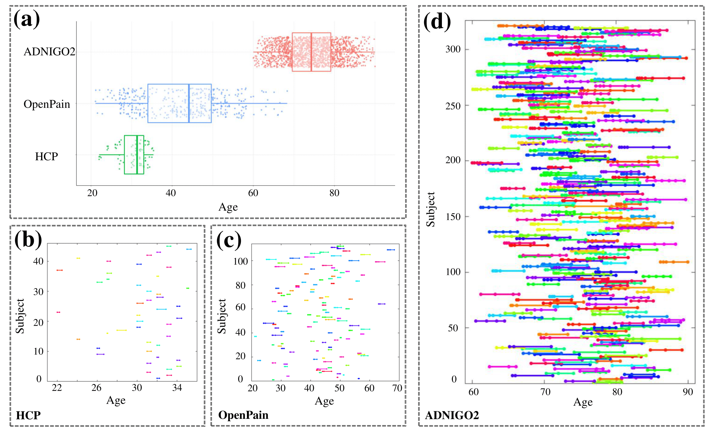 
  *Panel (a) shows age distributions in the three datasets. The rest panels show the temporal information on scans for each subject.*

## PCA Results

PCA results of the ADNI dataset. (a) shows the Karcher mean of all surfaces in the ADNIGO2 dataset. Panel (b) shows the cumulative percentage of variance explained by
the number of principal components (PCs). As shown here, the use of 33 and 61 PCs can represent the 95% variation of all lateral ventricle and left hippocampus surfaces seperately. Panel (c) shows the first PC direction in the shape space by reconstructing the principal geodesic as f&mu;+t &radic;&lambda;1PC1, where PC1 represents the first principal direction. We then bring the temporal labels back (the time of each observation) and plot the area trajectories for all subjects in panel (d) and PC1 score trajectories in panel (e).

1) **Lateral Ventricle**\
   PCA results of the ADNI’s lateral ventricle surfaces. (a) Karcher mean of all lateral ventricle surfaces. (b) Cumulative percentage of variance explained by the number of PCs. (c) First dominant PC direction reconstructed as  f&mu;+t &radic;&lambda;1PC1 . The five shapes in the front view, from left to right, correspond to t = {−1; −0:5; 0; 0:5; 1}. (c) Surface area trajectories. (e) PC1 score trajectories. 
   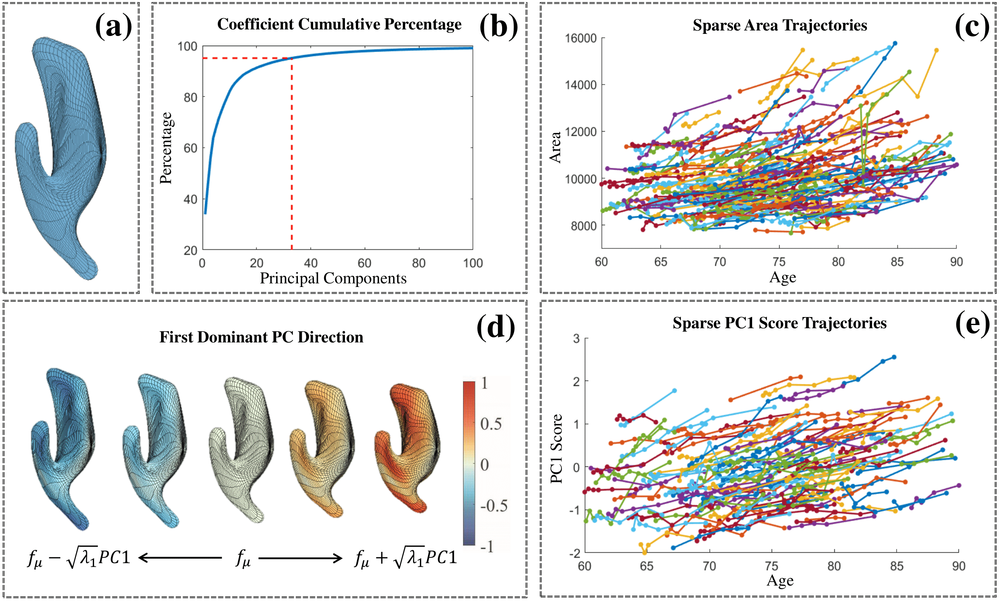  
  

2) **Left hippocampus**\
   PCA results of the ADNI’s left hippocampus surfaces. (a) Karcher mean of all left hippocampus surfaces. (b) Cumulative percentage of variance explained by the number of PCs. (c) First dominant PC direction reconstructed as  f&mu;+t &radic;&lambda;1PC1 . The five shapes in the front view, from left to right, correspond to t = {−1; −0:5; 0; 0:5; 1}. (c) Surface area trajectories. (e) PC1 score trajectories. 
   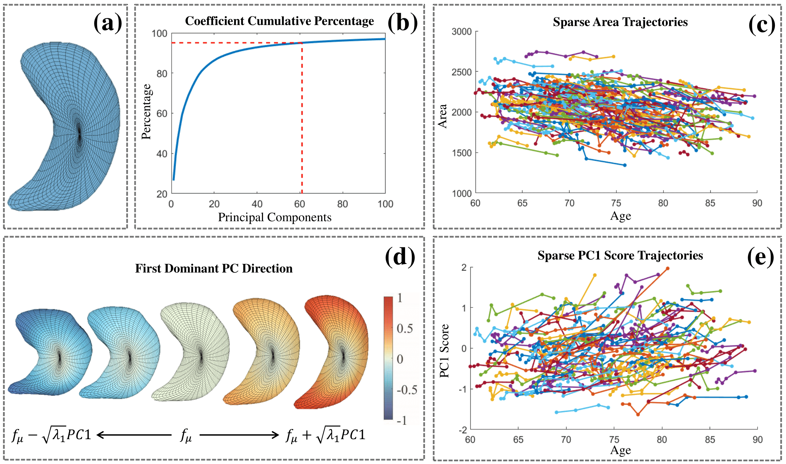  

## Shape Trajectory Fitting Results
We densely fit area trajectories and principal coefficients trajectories with two methods: PACE and MGCV, and we compare the performance under two methods.

1) **Lateral ventricle trajectories:**\
   (a) Trajectory fitting results of LESA from the observed sparse data. First column: sparse surface area and PC score trajectories. Second and third columns: continuous trajectories fitted by the PACE and MGCV models (black dashed lines: mean trajectories). First row: area trajectories. Second row: PC1 score trajectories. 
   
   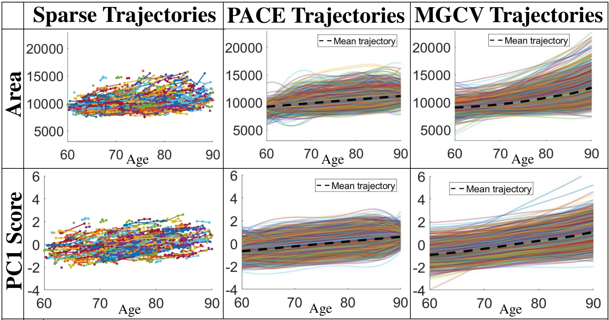  
   
   Recovered mean surface trajectories by:  
   &nbsp; &nbsp; &nbsp; &nbsp; &nbsp; &nbsp; &nbsp; &nbsp; &nbsp; (b) PACE fitting; &nbsp; &nbsp; &nbsp; &nbsp; &nbsp; &nbsp; &nbsp; &nbsp; &nbsp; &nbsp; &nbsp; &nbsp; &nbsp; &nbsp; &nbsp; &nbsp; &nbsp; &nbsp; &nbsp; &nbsp; (c) MGCV fitting. 
    
   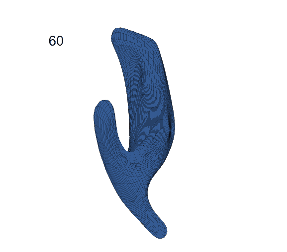 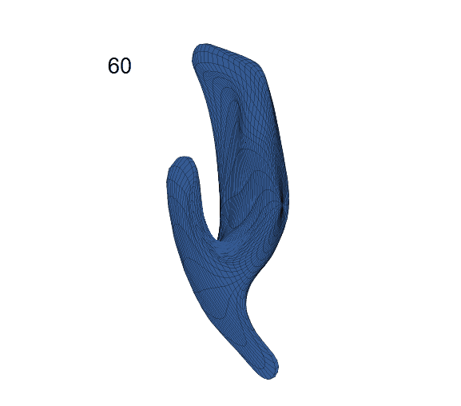  
  
2) **Left hippocampus trajectories:**\
   (a) Trajectory fitting results of LESA from the observed sparse data. First column: sparse surface area and PC score trajectories. Second and third columns: continuous trajectories fitted by the PACE and MGCV models (black dashed lines: mean trajectories). First row: area trajectories. Second row: PC1 score trajectories. 
   
   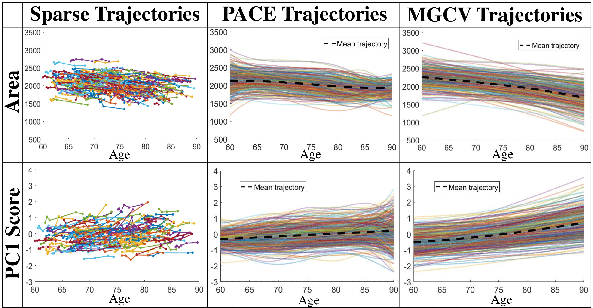 
   
   Recovered mean surface trajectories by:  
   &nbsp; &nbsp; &nbsp; &nbsp; &nbsp; &nbsp; &nbsp; &nbsp; &nbsp; (b) PACE fitting; &nbsp; &nbsp; &nbsp; &nbsp; &nbsp; &nbsp; &nbsp; &nbsp; &nbsp; &nbsp; &nbsp; &nbsp; &nbsp; &nbsp; &nbsp; &nbsp; &nbsp; &nbsp; &nbsp; &nbsp; (c) MGCV fitting. 
    
    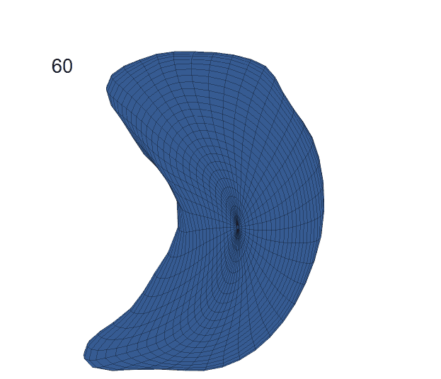 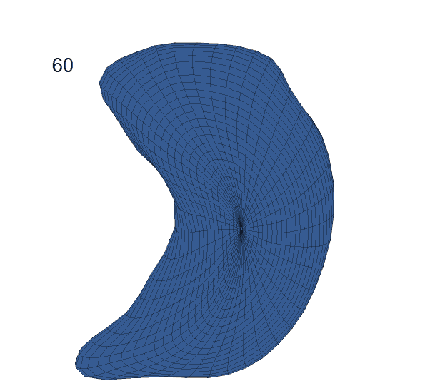  
   
3) **Some individual fitting examples:**\
   Individual surface trajectories fitted with LESA. Panels (a) and (b) show the raw and fitted trajectories for the surface area and PC1 score for three individual subjects. 
   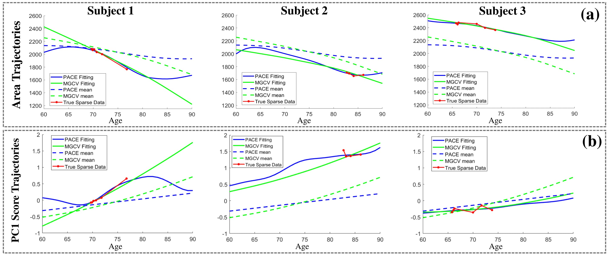  

   Reconstructed surface trajectories of:  
   (c) Sub.1 with PACE; &nbsp; &nbsp;(d) Sub.1 with MGCV; &nbsp; &nbsp; (e) Sub.2 with PACE; &nbsp; &nbsp;(f) Sub.2 with MGCV.  
   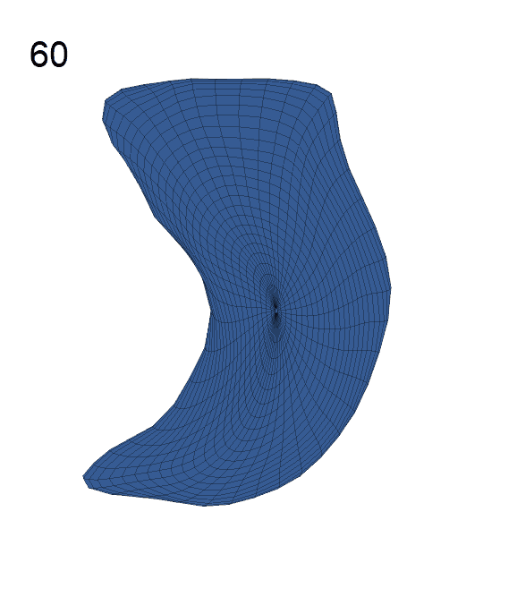 &nbsp; &nbsp;
   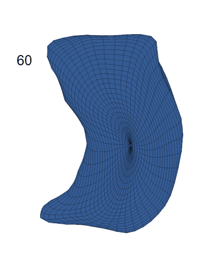 &nbsp; &nbsp;
   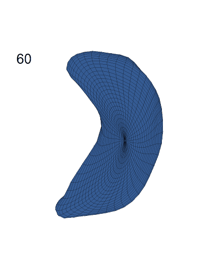 &nbsp; &nbsp;
   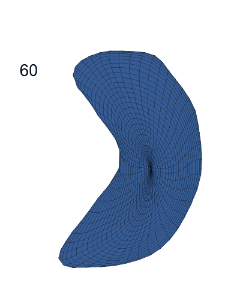 

4) **Performance comparison:**\
    Mean squared prediction errors of PACE and MGCV.
    <table>
   
    ||**Lateral Ventricle**|**Lateral Ventricle**|**Left Hippocampus**|**Left Hippocampus**|
    | -------- | ----------- | ------------ | ----------- | ------------ |
    |          |  **PACE**   |   **MGCV**   |   **PACE**  |   **MGCV**   |
    | **Area** |**112.4383** |   116.2736   | **27.0840** |    31.4153   |
    | **PC1**  |  **0.0367** |    0.0438    |  **0.0246** |    0.0256    |
    | **PC2**  |  **0.0458** |    0.0523    |  **0.0364** |    0.0387    |
    | **PC3**  |  **0.0530** |    0.0558    |  **0.0290** |    0.0303    |
    | **PC4**  |  **0.0490** |    0.0511    |  **0.0320** |    0.0337    |
    | **PC5**  |  **0.0422** |    0.0441    |  **0.0422** |    0.0452    | 
    | **....** |    ....     |      ....    |     ....    |      ....    |
    | **Average PC MSPE** | **0.0536** | 0.0565 |  **0.0423**  |  0.0442  |
  
    </table>

## Life-span Shape Change
   Life-span (22-90 years old) left ventricle and left hippocampus growth trajectories. (a-b) Observed sparse data and fitted mean trajectories (black solid line).  
   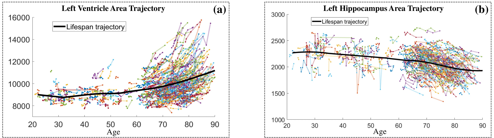 
   
   Reconstructed life-span mean surface trajectories. Color on each surface indicates the surface’s deformation size compared with the surface at age 22:  
   &nbsp; &nbsp; &nbsp; &nbsp; &nbsp; &nbsp; &nbsp; &nbsp;(c) Lateral Ventricle; &nbsp; &nbsp; &nbsp; &nbsp; &nbsp; &nbsp; &nbsp; &nbsp; &nbsp; &nbsp; &nbsp; &nbsp; &nbsp; &nbsp; &nbsp; (d) Left Hippocampus.  
   
   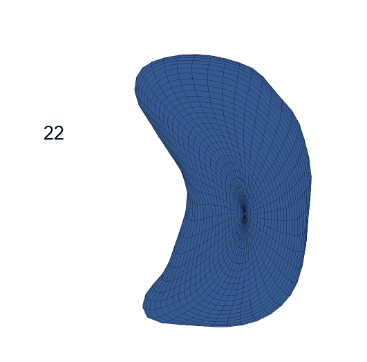
    
  
## Group Difference Analysis
1) **Lateral ventricle:**\
   Comparison of shape change patterns among AD, MCI and NC. (a) Mean surface area trajectories of the three groups (blue: AD; red: MCI; yellow: NC). (b) Changing rate of the area trajectories calculated as 100∗(&alpha;(ti+1) − &alpha;(ti))/&alpha;(ti).  
   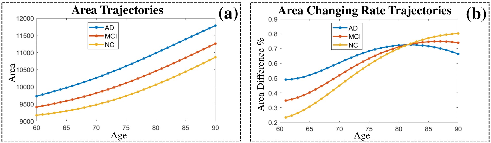 
      
   (c) Reconstructed mean shape trajectories. Color on the surface represents shape difference compared with the NC surface at the corresponding time:  
   &nbsp; &nbsp; &nbsp; &nbsp; &nbsp; &nbsp; &nbsp; &nbsp; &nbsp; &nbsp; &nbsp; AD &nbsp; &nbsp; &nbsp; &nbsp; &nbsp; &nbsp; &nbsp; &nbsp; &nbsp; &nbsp; &nbsp; &nbsp; &nbsp; &nbsp; &nbsp; &nbsp; &nbsp; &nbsp; &nbsp; MCI &nbsp; &nbsp; &nbsp; &nbsp; &nbsp; &nbsp; &nbsp; &nbsp; &nbsp; &nbsp; &nbsp; &nbsp; &nbsp; &nbsp; &nbsp; &nbsp; &nbsp; &nbsp; &nbsp; &nbsp; NC  
    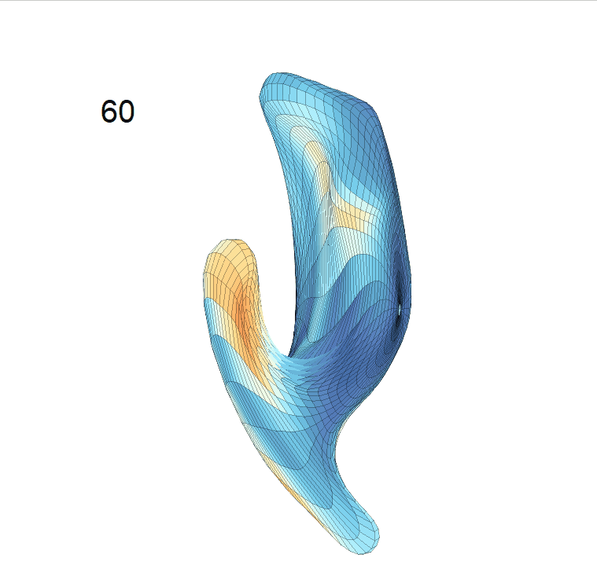
    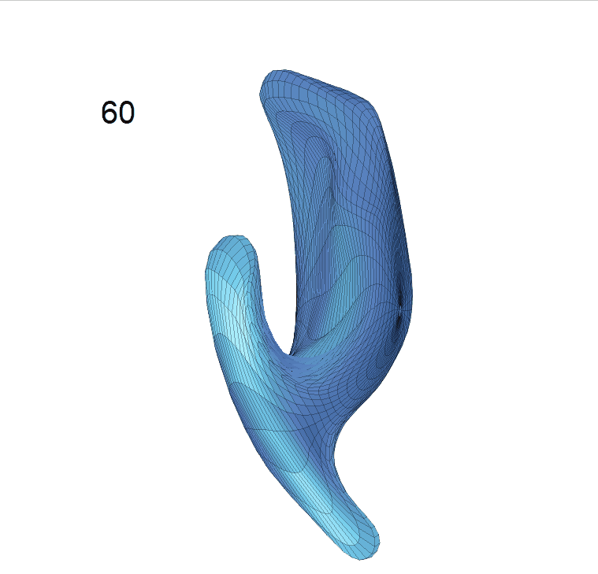
    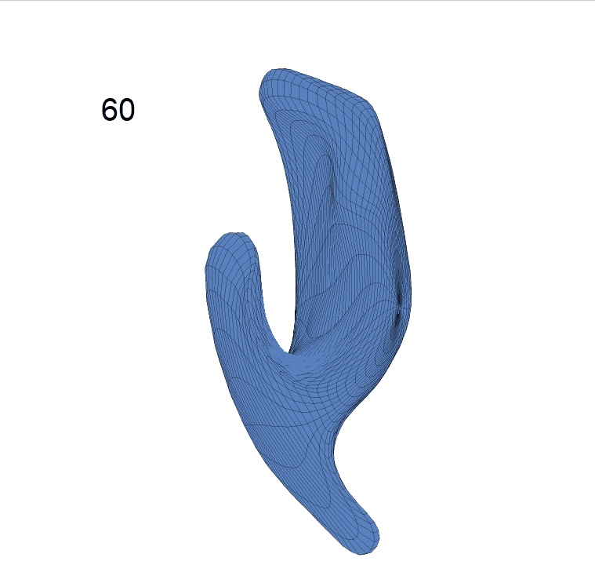
    
2) **Left hippocampus:**\
   Comparison of shape change patterns among AD, MCI and NC. (a) Mean surface area trajectories of the three groups (blue: AD; red: MCI; yellow: NC). (b) Changing rate of the area trajectories calculated as 100∗(&alpha;(ti+1) − &alpha;(ti))/&alpha;(ti).  
   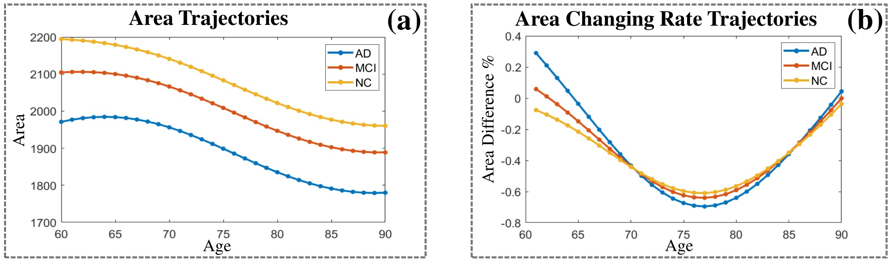 
      
   (c) Reconstructed mean shape trajectories. Color on the surface represents shape difference compared with the NC surface at the corresponding time:  
   &nbsp; &nbsp; &nbsp; &nbsp; &nbsp; &nbsp; &nbsp; &nbsp; &nbsp; &nbsp; &nbsp; AD &nbsp; &nbsp; &nbsp; &nbsp; &nbsp; &nbsp; &nbsp; &nbsp; &nbsp; &nbsp; &nbsp; &nbsp; &nbsp; &nbsp; &nbsp; &nbsp; &nbsp; &nbsp; &nbsp; MCI &nbsp; &nbsp; &nbsp; &nbsp; &nbsp; &nbsp; &nbsp; &nbsp; &nbsp; &nbsp; &nbsp; &nbsp; &nbsp; &nbsp; &nbsp; &nbsp; &nbsp; &nbsp; &nbsp; &nbsp; NC  
    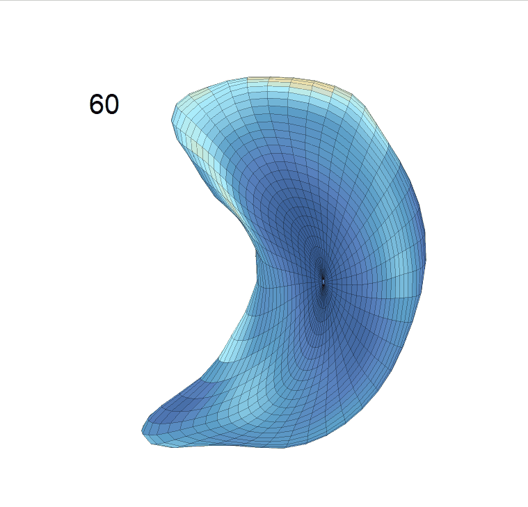
    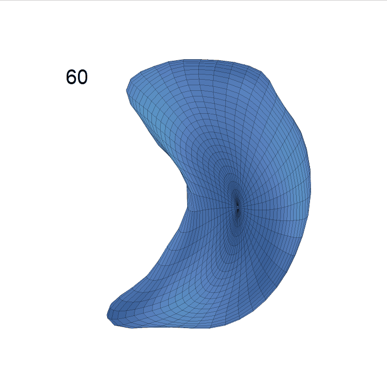
    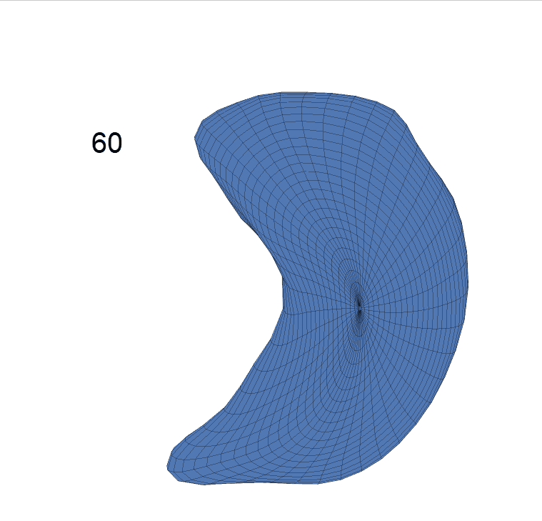

## Shape-trajectory-on-scalar Regression Analysis
1) **Evaluation:**\
   Evaluation of the shape-trajectory-on-scalar regression on the ADNIGO2 dataset. (a) Histogram of the percentage of improvement in prediction error when comparing the shapetrajectory-on-scalar regression with the baseline model. (b) Examples of original sparse surface, surface reconstructed by the regression’s prediction, and the global mean surface. Color indicates the small patch’s difference level. First row: lateral ventricle; second row: left hippocampus.  
     
    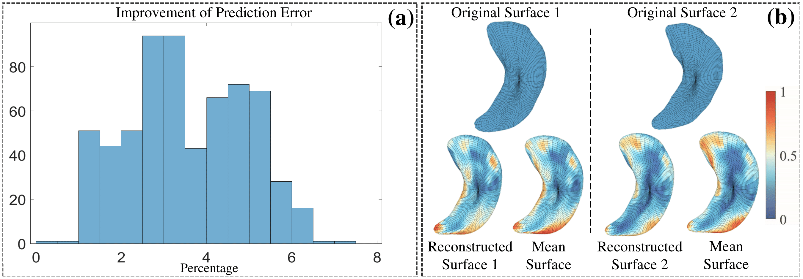 

2) **Covariates’ effect to the surface trajectory:**\
   **Lateral ventricle:**\
   Exploration of the covariates’ effect to the surface trajectory on ADNIGO2 dataset. Panel (i) shows results for the left ventricle and panel (ii) shows results for the left hippocampus. In each sub-panel (a), we fixed gender, marriage status, education years and ApoE4 type and varied the diagnosis status. In each sub-panel (b), we fixed gender, marriage status, education years and diagnosis status, and varied the ApoE4 type. 
   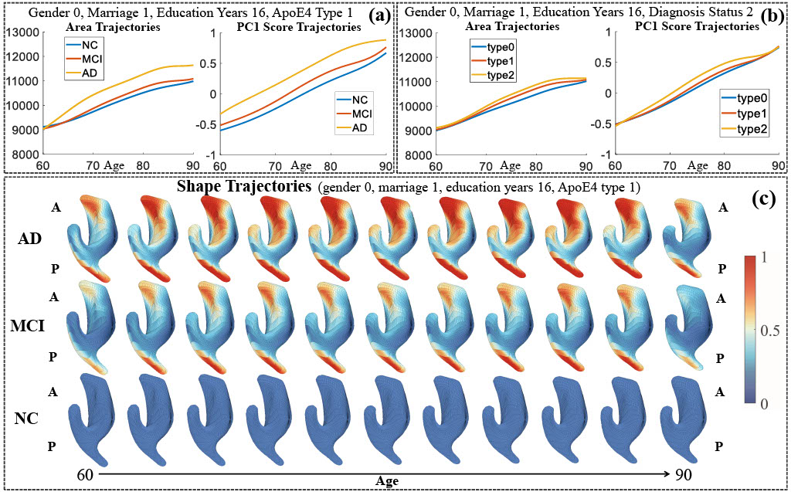 
   
   (c) Each sub-panel shows the reconstructed shape trajectory by fixing gender, marriage status, education years and ApoE4 type, while varying the diagnosis status. Color on each surface represents shape difference compared with the NC surface at the same age: 
   &nbsp; &nbsp; &nbsp; &nbsp; &nbsp; &nbsp; &nbsp; &nbsp; &nbsp; &nbsp; &nbsp; &nbsp; &nbsp;AD &nbsp; &nbsp; &nbsp; &nbsp; &nbsp; &nbsp; &nbsp; &nbsp; &nbsp; &nbsp; &nbsp; &nbsp; &nbsp; &nbsp; &nbsp; &nbsp; &nbsp; &nbsp; &nbsp; &nbsp; &nbsp;MCI &nbsp; &nbsp; &nbsp; &nbsp; &nbsp; &nbsp; &nbsp; &nbsp; &nbsp; &nbsp; &nbsp; &nbsp; &nbsp; &nbsp; &nbsp; &nbsp; &nbsp; &nbsp; &nbsp; &nbsp; NC  
    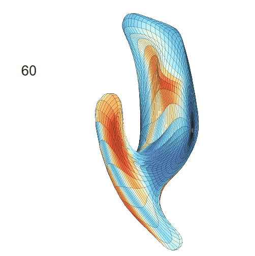
    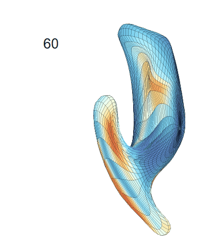
    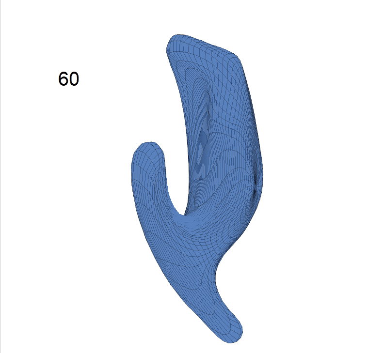
   
   **Left hippocampus:**\
   Exploration of the covariates’ effect to the surface trajectory on ADNIGO2 dataset. Panel (i) shows results for the left ventricle and panel (ii) shows results for the left hippocampus. In each sub-panel (a), we fixed gender, marriage status, education years and ApoE4 type and varied the diagnosis status. In each sub-panel (b), we fixed gender, marriage status, education years and diagnosis status, and varied the ApoE4 type. 
   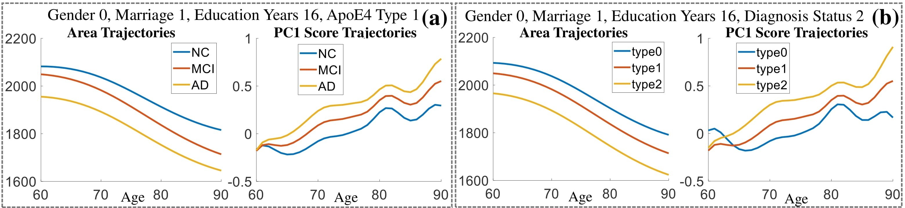 
   
   (c) Each sub-panel shows the reconstructed shape trajectory by fixing gender, marriage status, education years and ApoE4 type, while varying the diagnosis status. Color on each surface represents shape difference compared with the NC surface at the same age: 
   &nbsp; &nbsp; &nbsp; &nbsp; &nbsp; &nbsp; &nbsp; &nbsp; &nbsp; &nbsp; &nbsp; &nbsp; &nbsp;AD &nbsp; &nbsp; &nbsp; &nbsp; &nbsp; &nbsp; &nbsp; &nbsp; &nbsp; &nbsp; &nbsp; &nbsp; &nbsp; &nbsp; &nbsp; &nbsp; &nbsp; &nbsp; &nbsp; &nbsp; &nbsp;MCI &nbsp; &nbsp; &nbsp; &nbsp; &nbsp; &nbsp; &nbsp; &nbsp; &nbsp; &nbsp; &nbsp; &nbsp; &nbsp; &nbsp; &nbsp; &nbsp; &nbsp; &nbsp; &nbsp; &nbsp; NC  
    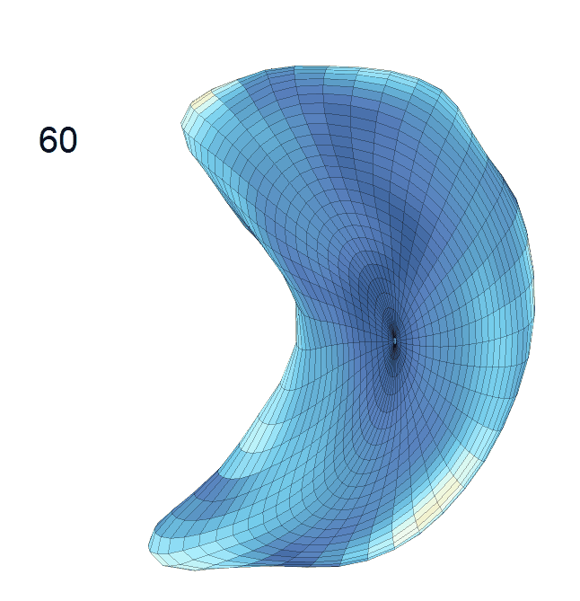
    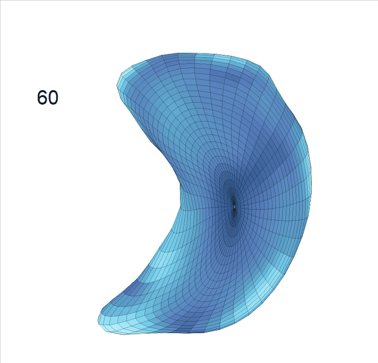
    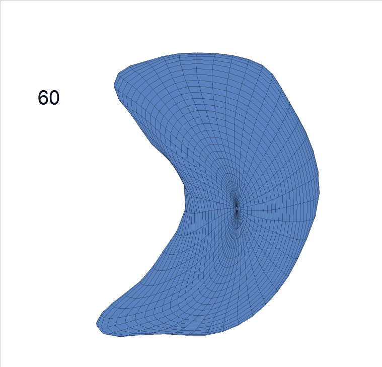
   
